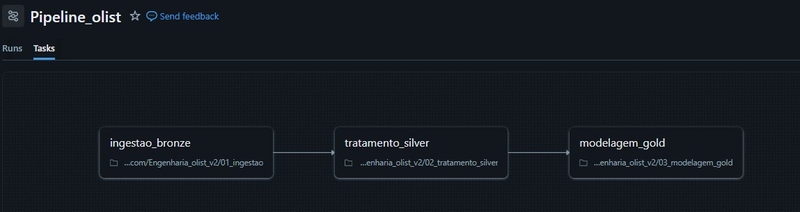

# Pipeline de Engenharia de Dados - E-commerce Olist 🛒

Este projeto consiste em um pipeline de dados completo (End-to-End) construído no **Databricks Community Edition**, processando dados reais do E-commerce brasileiro (Olist).

## ARCHITECTURE 🏗️
Os dados fluem através da arquitetura **Medallion** (Bronze, Silver, Gold):

1.  **Bronze (Ingestão):** Extração de dados crus via scripts Python (Bypass de segurança do Databricks Community) e ingestão automatizada.
2.  **Silver (Tratamento):** Limpeza, deduplicação, conversão de tipos (Decimal/Date) e regras de negócio usando **PySpark**.
3.  **Gold (Analytics):** Modelagem Dimensional (Star Schema) com tabelas Fato e Dimensão otimizadas com **Delta Lake (Z-Order)**.

## TECHNOLOGIES 🛠️
* **Cloud:** Databricks Community Edition
* **Language:** Python (PySpark, Pandas)
* **Storage:** Delta Lake
* **Orchestration:** Databricks Workflows & Conceitos de Airflow
* **Data Quality:** Validação de Schema e tratamento de nulos

## KEY RESULTS 📊
* Processamento de +100k pedidos.
* Identificação da categoria campeã de vendas: **Beleza e Saúde**.
* Identificação de gargalos de recuperação de crédito por setor.

## HOW TO RUN 🚀
1.  Clone este repositório.
2.  Importe os arquivos `.py` para o seu Workspace no Databricks.
3.  Execute o job `01_ingestao` para carregar os dados.